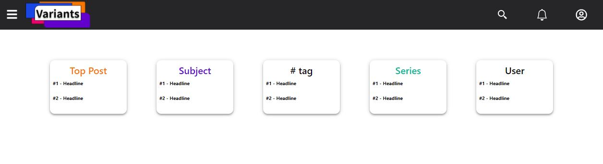

## PROPAGANDA Project "Variants" React JS Fundamantal

### Description
1. icons : react-icons [https://react-icons.github.io/react-icons]
2. style : react-bootstrap [https://react-bootstrap.github.io/]
3. Editor : react-quill [https://www.npmjs.com/package/react-quill#import-the-component]

### Excute
<pre>
<code>
npm start
</code>
</pre>

### Example

### Contributors
*Design, Lead : JongHyo Park
*Develop : JunHo Shin
